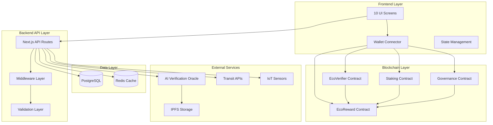
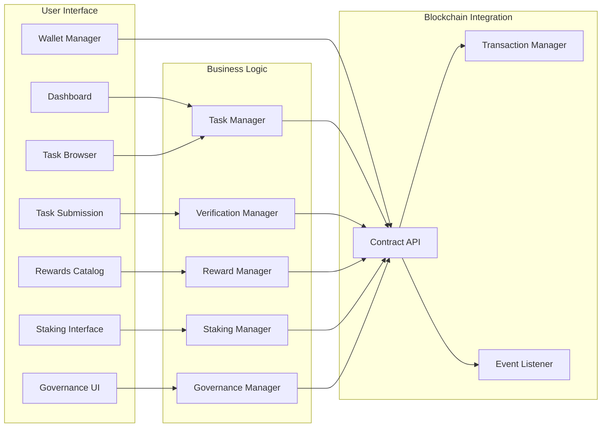
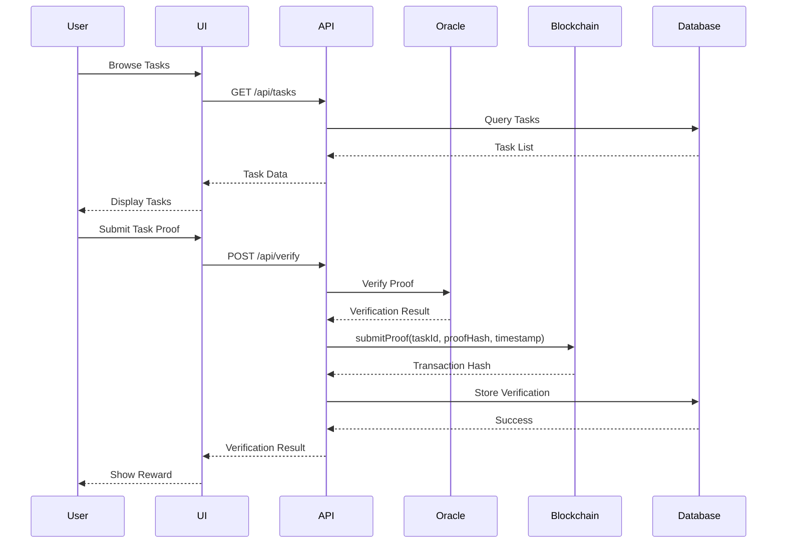

# Design Document: Blockchain Eco Rewards Integration

## Overview

This design transforms the existing 10 static Figma screens into a fully functional blockchain-enabled Eco Rewards Platform with real backend logic and smart contract integration. The platform enables users to complete eco-friendly tasks (recycling, public transport, energy savings, community service), earn ECO tokens through blockchain verification, stake tokens for long-term rewards, redeem rewards from merchant partners, and participate in DAO governance.

The system integrates with existing EcoReward.sol (ERC20 token) and EcoVerifier.sol (task verification and reward minting) smart contracts deployed on the Initia appchain. It maintains compatibility with the existing Next.js 16.2.1, React 19.2.4, TypeScript 5, Tailwind CSS stack, and Clerk authentication while adding wallet-based authentication and blockchain transaction capabilities.

Key architectural components include: (1) Frontend layer with 10 enhanced UI screens, (2) Backend API layer with task management, verification, rewards, and governance endpoints, (3) Blockchain layer with smart contract interactions via wagmi/viem, (4) AI verification system using oracle integration, (5) Database layer using PostgreSQL/Prisma for off-chain data, and (6) Analytics and metrics collection system.

## Architecture

### System Architecture Overview



### Component Architecture




### Data Flow Architecture




## Components and Interfaces

### 1. Task Management System

**Purpose**: Manage eco-task lifecycle including browsing, selection, and submission

**Interface**:
```typescript
interface TaskManager {
  getTasks(filters: TaskFilters): Promise<Task[]>
  getTaskById(taskId: string): Promise<Task>
  submitTaskProof(submission: TaskSubmission): Promise<SubmissionResult>
  getTaskHistory(userId: string): Promise<TaskHistory[]>
}

interface Task {
  id: string
  name: string
  description: string
  category: TaskCategory
  baseReward: number
  bonusMultiplier: number
  verificationHint: string
  verificationMethod: VerificationMethod
  requirements: TaskRequirement[]
}

interface TaskSubmission {
  taskId: string
  userId: string
  proofType: ProofType
  proofData: ProofData
  timestamp: number
  geoLocation?: GeoLocation
}
```


**Responsibilities**:
- Fetch and cache available eco-tasks from database
- Filter tasks by category, reward range, and user eligibility
- Validate task submission data before verification
- Track task completion history and streaks
- Calculate bonus multipliers based on user performance

### 2. Verification System

**Purpose**: Verify task completion using AI oracles and smart contracts

**Interface**:
```typescript
interface VerificationManager {
  verifyProof(submission: TaskSubmission): Promise<VerificationResult>
  getVerificationStatus(verificationId: string): Promise<VerificationStatus>
  resubmitProof(verificationId: string, newProof: ProofData): Promise<VerificationResult>
}

interface VerificationResult {
  verified: boolean
  verificationId: string
  taskId: string
  reward: number
  transactionHash?: string
  reason?: string
  confidence: number
}

interface OracleVerification {
  proofHash: string
  oracleSource: string
  confidence: number
  metadata: Record<string, unknown>
}
```


**Responsibilities**:
- Validate proof data format and completeness
- Route verification to appropriate oracle (AI vision, transit API, IoT sensor)
- Generate unique proof hash to prevent replay attacks
- Submit verified proofs to EcoVerifier smart contract
- Handle verification failures and retry logic
- Store verification records in database

### 3. Blockchain Integration Layer

**Purpose**: Manage wallet connections and smart contract interactions

**Interface**:
```typescript
interface BlockchainManager {
  connectWallet(): Promise<WalletConnection>
  disconnectWallet(): Promise<void>
  getBalance(address: string): Promise<TokenBalance>
  submitProof(taskId: string, proofHash: string, timestamp: number): Promise<Transaction>
  stakeTokens(amount: number, duration: number): Promise<Transaction>
  unstakeTokens(stakeId: string): Promise<Transaction>
  redeemReward(rewardId: string, amount: number): Promise<Transaction>
}

interface WalletConnection {
  address: string
  chainId: number
  isConnected: boolean
  provider: Provider
}
```


interface Transaction {
  hash: string
  status: TransactionStatus
  blockNumber?: number
  gasUsed?: bigint
  timestamp: number
}

interface TokenBalance {
  total: bigint
  available: bigint
  staked: bigint
  pending: bigint
}
```

**Responsibilities**:
- Manage wallet connection state using wagmi/viem
- Handle transaction signing and submission
- Monitor transaction status and confirmations
- Listen to contract events (ProofSubmitted, TokensMinted, etc.)
- Manage gas estimation and transaction retries
- Support Initia Auto-sign for seamless UX

### 4. Rewards and Redemption System

**Purpose**: Manage reward catalog and token redemption

**Interface**:
```typescript
interface RewardManager {
  getRewards(filters: RewardFilters): Promise<Reward[]>
  redeemReward(userId: string, rewardId: string): Promise<RedemptionResult>
  getRedemptionHistory(userId: string): Promise<Redemption[]>
}
```


interface Reward {
  id: string
  title: string
  description: string
  cost: number
  partner: string
  category: string
  available: boolean
  stock?: number
  expiresAt?: Date
}

interface RedemptionResult {
  success: boolean
  redemptionId: string
  reward: Reward
  balanceBefore: number
  balanceAfter: number
  voucherCode?: string
}
```

**Responsibilities**:
- Fetch available rewards from merchant partners
- Validate user balance before redemption
- Process token burn/transfer for redemption
- Generate voucher codes or redemption proofs
- Track redemption history and analytics
- Handle partner API integrations

### 5. Staking System

**Purpose**: Enable long-term token staking for additional rewards

**Interface**:
```typescript
interface StakingManager {
  stake(userId: string, amount: number, duration: number): Promise<StakeResult>
  unstake(userId: string, stakeId: string): Promise<UnstakeResult>
  getStakes(userId: string): Promise<Stake[]>
  calculateRewards(stakeId: string): Promise<number>
}
```


interface Stake {
  id: string
  userId: string
  amount: number
  startTime: number
  duration: number
  endTime: number
  apy: number
  status: StakeStatus
  accruedRewards: number
}

interface StakeResult {
  stakeId: string
  transactionHash: string
  amount: number
  expectedRewards: number
  unlockTime: number
}
```

**Responsibilities**:
- Calculate staking APY based on duration and amount
- Lock tokens in staking contract
- Track accrued rewards over time
- Handle early unstaking penalties
- Distribute staking rewards
- Provide staking analytics and projections

### 6. Governance System

**Purpose**: Enable DAO-based governance for platform decisions

**Interface**:
```typescript
interface GovernanceManager {
  getProposals(filters: ProposalFilters): Promise<Proposal[]>
  createProposal(proposal: ProposalData): Promise<Proposal>
  vote(userId: string, proposalId: string, vote: Vote): Promise<VoteResult>
  executeProposal(proposalId: string): Promise<ExecutionResult>
}
```


interface Proposal {
  id: string
  title: string
  description: string
  proposer: string
  status: ProposalStatus
  votesFor: number
  votesAgainst: number
  votesAbstain: number
  quorum: number
  startTime: number
  endTime: number
  executionTime?: number
}

interface Vote {
  support: VoteType
  reason?: string
  votingPower: number
}
```

**Responsibilities**:
- Manage proposal lifecycle (creation, voting, execution)
- Calculate voting power based on token holdings
- Enforce quorum and voting period requirements
- Execute approved proposals on-chain
- Track voting history and participation
- Provide governance analytics

## Data Models

### User Model

```typescript
interface User {
  id: string
  clerkId: string
  initiaAddress: string
  initiaUsername?: string
  displayName?: string
  region?: string
  streakDays: number
  totalRewards: number
  level: number
  badges: Badge[]
  createdAt: Date
  updatedAt: Date
}
```


**Validation Rules**:
- initiaAddress must be valid Bech32 format
- clerkId must be unique
- streakDays resets if no activity for 24 hours
- level calculated based on totalRewards milestones

### Task Model

```typescript
interface Task {
  id: string
  slug: string
  name: string
  description: string
  category: TaskCategory
  baseReward: number
  bonusFactor: number
  verificationHint: string
  verificationMethod: VerificationMethod
  requirements: TaskRequirement[]
  active: boolean
  createdAt: Date
}

enum TaskCategory {
  TRANSIT = "transit",
  RECYCLING = "recycling",
  ENERGY = "energy",
  COMMUNITY = "community"
}

enum VerificationMethod {
  PHOTO = "photo",
  API = "api",
  IOT = "iot",
  MANUAL = "manual",
  ORACLE = "oracle"
}
```

**Validation Rules**:
- baseReward must be positive integer
- bonusFactor must be between 1.0 and 2.0
- slug must be unique and URL-safe
- category must be valid enum value


### Verification Model

```typescript
interface Verification {
  id: string
  taskId: string
  userId: string
  proofHash: string
  proofType: ProofType
  proofData: ProofData
  geoHash?: string
  status: VerificationStatus
  reward: number
  oracleSource?: string
  oracleConfidence?: number
  transactionHash?: string
  verifiedAt: Date
  metadata?: Record<string, unknown>
}

enum VerificationStatus {
  PENDING = "pending",
  VERIFIED = "verified",
  REJECTED = "rejected",
  EXPIRED = "expired"
}

enum ProofType {
  PHOTO = "photo",
  TRANSIT_CARD = "transit",
  WEIGHT = "weight",
  SENSOR = "sensor",
  API_DATA = "api"
}
```

**Validation Rules**:
- proofHash must be unique (prevent replay attacks)
- timestamp must be within 48 hours
- geoHash validated if task requires location
- oracleConfidence must be >= 0.7 for auto-approval


### Ledger Entry Model

```typescript
interface LedgerEntry {
  id: string
  userId: string
  amount: number
  type: LedgerEntryType
  source: string
  transactionHash?: string
  metadata?: Record<string, unknown>
  createdAt: Date
}

enum LedgerEntryType {
  MINT = "mint",
  BURN = "burn",
  STAKE = "stake",
  UNSTAKE = "unstake",
  REWARD = "reward",
  REDEMPTION = "redemption"
}
```

**Validation Rules**:
- amount must be non-zero
- type must match source operation
- transactionHash required for blockchain operations
- createdAt must be chronological

### Stake Model

```typescript
interface Stake {
  id: string
  userId: string
  amount: number
  apy: number
  startTime: Date
  duration: number
  endTime: Date
  status: StakeStatus
  accruedRewards: number
  transactionHash: string
}

enum StakeStatus {
  ACTIVE = "active",
  COMPLETED = "completed",
  WITHDRAWN = "withdrawn",
  PENALIZED = "penalized"
}
```


**Validation Rules**:
- amount must be >= minimum stake amount (100 ECO)
- duration must be 30, 90, 180, or 365 days
- apy calculated based on duration tier
- early withdrawal incurs 10% penalty

## Algorithmic Pseudocode

### Main Task Verification Algorithm

```typescript
ALGORITHM verifyTaskSubmission(submission: TaskSubmission): VerificationResult
INPUT: submission containing taskId, userId, proofData, timestamp
OUTPUT: VerificationResult with verified status and reward amount

PRECONDITIONS:
  - submission.taskId exists in database
  - submission.userId is authenticated
  - submission.timestamp is within 48 hours
  - submission.proofHash is unique

POSTCONDITIONS:
  - If verified: tokens minted to user wallet
  - Verification record stored in database
  - User streak updated if applicable
  - Returns verification result with transaction hash

BEGIN
  // Step 1: Validate submission data
  task ← database.getTask(submission.taskId)
  ASSERT task.exists AND task.active
  
  proofHash ← generateProofHash(submission.proofData, submission.timestamp)
  ASSERT NOT database.proofHashExists(proofHash)
  
  // Step 2: Verify proof based on verification method
  verificationResult ← NULL
  
  MATCH task.verificationMethod WITH
    CASE VerificationMethod.PHOTO:
      verificationResult ← verifyPhotoProof(submission.proofData)
    CASE VerificationMethod.API:
      verificationResult ← verifyAPIProof(submission.proofData)
    CASE VerificationMethod.IOT:
      verificationResult ← verifyIOTProof(submission.proofData)
    CASE VerificationMethod.ORACLE:
      verificationResult ← verifyOracleProof(submission.proofData)
  END MATCH
  
  // Step 3: Check verification confidence threshold
  IF verificationResult.confidence < 0.7 THEN
    RETURN VerificationResult(verified: false, reason: "Low confidence")
  END IF
  
  // Step 4: Calculate reward with bonuses
  baseReward ← task.baseReward
  bonusMultiplier ← calculateBonusMultiplier(submission.userId, task)
  finalReward ← baseReward * bonusMultiplier
  
  // Step 5: Submit to blockchain
  txHash ← blockchain.submitProof(
    task.id,
    proofHash,
    submission.timestamp
  )
  
  // Step 6: Store verification record
  verification ← database.createVerification({
    taskId: task.id,
    userId: submission.userId,
    proofHash: proofHash,
    status: VerificationStatus.VERIFIED,
    reward: finalReward,
    transactionHash: txHash,
    oracleConfidence: verificationResult.confidence
  })
  
  // Step 7: Update user streak
  updateUserStreak(submission.userId)
  
  RETURN VerificationResult(
    verified: true,
    verificationId: verification.id,
    reward: finalReward,
    transactionHash: txHash
  )
END
```

**Loop Invariants**: N/A (no loops in main algorithm)


### Bonus Multiplier Calculation Algorithm

```typescript
ALGORITHM calculateBonusMultiplier(userId: string, task: Task): number
INPUT: userId and task object
OUTPUT: bonus multiplier between 1.0 and 2.0

PRECONDITIONS:
  - userId exists in database
  - task has valid bonusFactor

POSTCONDITIONS:
  - Returns multiplier >= 1.0 and <= 2.0
  - Multiplier increases with streak and task completion count

BEGIN
  user ← database.getUser(userId)
  taskHistory ← database.getUserTaskHistory(userId, task.category)
  
  // Base multiplier from task
  multiplier ← task.bonusFactor
  
  // Streak bonus: +0.01 per day, max +0.3
  streakBonus ← MIN(user.streakDays * 0.01, 0.3)
  multiplier ← multiplier + streakBonus
  
  // Category mastery bonus: +0.05 per 10 completions, max +0.2
  categoryCount ← taskHistory.length
  masteryBonus ← MIN(FLOOR(categoryCount / 10) * 0.05, 0.2)
  multiplier ← multiplier + masteryBonus
  
  // Cap at 2.0x
  multiplier ← MIN(multiplier, 2.0)
  
  RETURN multiplier
END
```


### Staking Reward Calculation Algorithm

```typescript
ALGORITHM calculateStakingRewards(stake: Stake): number
INPUT: stake object with amount, apy, startTime, duration
OUTPUT: accrued rewards in ECO tokens

PRECONDITIONS:
  - stake.status is ACTIVE
  - stake.amount > 0
  - stake.apy > 0

POSTCONDITIONS:
  - Returns non-negative reward amount
  - Rewards calculated based on elapsed time
  - Compound interest applied daily

BEGIN
  currentTime ← getCurrentTimestamp()
  elapsedTime ← currentTime - stake.startTime
  elapsedDays ← elapsedTime / (24 * 3600)
  
  // Daily compound interest formula
  // A = P(1 + r/n)^(nt)
  // where P = principal, r = annual rate, n = compounds per year, t = years
  
  principal ← stake.amount
  annualRate ← stake.apy / 100
  compoundsPerYear ← 365
  years ← elapsedDays / 365
  
  finalAmount ← principal * POWER(
    (1 + annualRate / compoundsPerYear),
    (compoundsPerYear * years)
  )
  
  accruedRewards ← finalAmount - principal
  
  RETURN accruedRewards
END
```

**Loop Invariants**: N/A (mathematical formula, no loops)


### Oracle Verification Algorithm

```typescript
ALGORITHM verifyOracleProof(proofData: ProofData): OracleVerificationResult
INPUT: proofData containing image, metadata, or sensor data
OUTPUT: OracleVerificationResult with confidence score

PRECONDITIONS:
  - proofData is non-empty
  - proofData format matches expected type
  - Oracle service is available

POSTCONDITIONS:
  - Returns confidence score between 0.0 and 1.0
  - Stores proof metadata in IPFS
  - Returns verification details

BEGIN
  // Step 1: Upload proof to IPFS for immutable storage
  ipfsHash ← ipfs.upload(proofData)
  
  // Step 2: Route to appropriate oracle
  oracleResult ← NULL
  
  MATCH proofData.type WITH
    CASE ProofType.PHOTO:
      oracleResult ← aiVisionOracle.verify(proofData.image)
    CASE ProofType.TRANSIT_CARD:
      oracleResult ← transitAPIOracle.verify(proofData.cardId)
    CASE ProofType.WEIGHT:
      oracleResult ← iotSensorOracle.verify(proofData.sensorId)
    CASE ProofType.SENSOR:
      oracleResult ← iotSensorOracle.verify(proofData.sensorId)
  END MATCH
  
  // Step 3: Validate oracle response
  ASSERT oracleResult.confidence >= 0.0 AND oracleResult.confidence <= 1.0
  
  // Step 4: Apply fraud detection heuristics
  fraudScore ← detectFraud(proofData, oracleResult)
  adjustedConfidence ← oracleResult.confidence * (1 - fraudScore)
  
  RETURN OracleVerificationResult(
    confidence: adjustedConfidence,
    ipfsHash: ipfsHash,
    oracleSource: oracleResult.source,
    metadata: oracleResult.metadata
  )
END
```


### Fraud Detection Algorithm

```typescript
ALGORITHM detectFraud(proofData: ProofData, oracleResult: OracleResult): number
INPUT: proofData and oracleResult
OUTPUT: fraud score between 0.0 (no fraud) and 1.0 (definite fraud)

PRECONDITIONS:
  - proofData contains userId
  - oracleResult contains metadata

POSTCONDITIONS:
  - Returns fraud score between 0.0 and 1.0
  - Higher score indicates higher fraud probability

BEGIN
  fraudScore ← 0.0
  
  // Check 1: Duplicate submission detection
  recentSubmissions ← database.getUserSubmissions(
    proofData.userId,
    last24Hours
  )
  
  FOR EACH submission IN recentSubmissions DO
    similarity ← calculateSimilarity(proofData, submission.proofData)
    IF similarity > 0.9 THEN
      fraudScore ← fraudScore + 0.3
    END IF
  END FOR
  
  // Check 2: Velocity check (too many submissions)
  submissionCount ← recentSubmissions.length
  IF submissionCount > 10 THEN
    fraudScore ← fraudScore + 0.2
  END IF
  
  // Check 3: Geolocation anomaly
  IF proofData.geoHash EXISTS THEN
    userHistory ← database.getUserGeoHistory(proofData.userId)
    IF isGeoAnomaly(proofData.geoHash, userHistory) THEN
      fraudScore ← fraudScore + 0.15
    END IF
  END IF
  
  // Check 4: Metadata inconsistencies
  IF hasMetadataInconsistencies(oracleResult.metadata) THEN
    fraudScore ← fraudScore + 0.25
  END IF
  
  // Cap at 1.0
  fraudScore ← MIN(fraudScore, 1.0)
  
  RETURN fraudScore
END
```

**Loop Invariants**:
- fraudScore remains between 0.0 and 1.0 throughout execution
- All checked submissions are within 24-hour window


## Key Functions with Formal Specifications

### Function 1: submitTaskProof()

```typescript
async function submitTaskProof(
  submission: TaskSubmission
): Promise<VerificationResult>
```

**Preconditions:**
- `submission.taskId` exists in database and task is active
- `submission.userId` is authenticated via Clerk or wallet
- `submission.timestamp` is within 48 hours of current time
- `submission.proofHash` is unique (not previously used)
- `submission.proofData` is non-empty and valid format

**Postconditions:**
- If successful: Returns `VerificationResult` with `verified: true`
- Tokens minted to user's wallet via EcoVerifier contract
- Verification record created in database with status "verified"
- User's streak updated if task completed within 24 hours of last task
- Transaction hash included in result
- If failed: Returns `VerificationResult` with `verified: false` and reason
- No tokens minted
- No database changes

**Loop Invariants:** N/A


### Function 2: stakeTokens()

```typescript
async function stakeTokens(
  userId: string,
  amount: number,
  duration: number
): Promise<StakeResult>
```

**Preconditions:**
- `userId` is authenticated
- `amount` >= 100 (minimum stake amount)
- `duration` is one of [30, 90, 180, 365] days
- User's available balance >= `amount`
- User has approved EcoReward contract to transfer tokens

**Postconditions:**
- If successful: Returns `StakeResult` with stakeId and transaction hash
- Tokens transferred from user wallet to staking contract
- Stake record created in database with status "active"
- User's available balance decreased by `amount`
- User's staked balance increased by `amount`
- APY calculated based on duration tier
- If failed: Returns error with reason
- No token transfer
- No database changes

**Loop Invariants:** N/A


### Function 3: redeemReward()

```typescript
async function redeemReward(
  userId: string,
  rewardId: string
): Promise<RedemptionResult>
```

**Preconditions:**
- `userId` is authenticated
- `rewardId` exists in database
- Reward is available (not out of stock)
- User's available balance >= reward.cost
- Reward has not expired

**Postconditions:**
- If successful: Returns `RedemptionResult` with success: true
- Tokens burned or transferred from user wallet
- Redemption record created in database
- User's balance decreased by reward.cost
- Voucher code generated if applicable
- Partner API notified of redemption
- If failed: Returns `RedemptionResult` with success: false and reason
- No token burn/transfer
- No database changes

**Loop Invariants:** N/A

### Function 4: voteOnProposal()

```typescript
async function voteOnProposal(
  userId: string,
  proposalId: string,
  vote: Vote
): Promise<VoteResult>
```

**Preconditions:**
- `userId` is authenticated
- `proposalId` exists and status is "active"
- Current time is within proposal voting period
- User has not already voted on this proposal
- User has token balance > 0 (voting power)

**Postconditions:**
- If successful: Returns `VoteResult` with success: true
- Vote recorded in database with user's voting power
- Proposal vote counts updated (votesFor/votesAgainst/votesAbstain)
- User marked as having voted on this proposal
- If failed: Returns error with reason
- No vote recorded
- No proposal updates

**Loop Invariants:** N/A


## Example Usage

### Example 1: Complete Task Workflow

```typescript
// User browses available tasks
const tasks = await taskManager.getTasks({ category: "transit" })

// User selects a task
const task = tasks[0] // "Low-impact commute"

// User submits proof (transit card tap)
const submission: TaskSubmission = {
  taskId: task.id,
  userId: currentUser.id,
  proofType: ProofType.TRANSIT_CARD,
  proofData: {
    cardId: "transit-card-12345",
    tapTime: Date.now(),
    station: "Central Station"
  },
  timestamp: Date.now(),
  geoLocation: { lat: 40.7128, lng: -74.0060 }
}

// Submit for verification
const result = await verificationManager.verifyProof(submission)

if (result.verified) {
  console.log(`Earned ${result.reward} ECO tokens!`)
  console.log(`Transaction: ${result.transactionHash}`)
  
  // Check updated balance
  const balance = await blockchainManager.getBalance(currentUser.initiaAddress)
  console.log(`New balance: ${balance.total} ECO`)
} else {
  console.error(`Verification failed: ${result.reason}`)
}
```


### Example 2: Staking Workflow

```typescript
// User checks available balance
const balance = await blockchainManager.getBalance(userAddress)
console.log(`Available: ${balance.available} ECO`)

// User stakes tokens for 90 days
const stakeAmount = 500 // 500 ECO
const stakeDuration = 90 // 90 days

const stakeResult = await stakingManager.stake(
  userId,
  stakeAmount,
  stakeDuration
)

console.log(`Staked ${stakeAmount} ECO for ${stakeDuration} days`)
console.log(`Expected rewards: ${stakeResult.expectedRewards} ECO`)
console.log(`Unlock time: ${new Date(stakeResult.unlockTime)}`)

// Check accrued rewards after some time
const stakes = await stakingManager.getStakes(userId)
const activeStake = stakes.find(s => s.id === stakeResult.stakeId)

const accruedRewards = await stakingManager.calculateRewards(activeStake.id)
console.log(`Accrued rewards: ${accruedRewards} ECO`)

// Unstake after duration completes
if (Date.now() >= activeStake.endTime) {
  const unstakeResult = await stakingManager.unstake(userId, activeStake.id)
  console.log(`Unstaked! Received ${unstakeResult.totalAmount} ECO`)
}
```


### Example 3: Reward Redemption Workflow

```typescript
// User browses reward catalog
const rewards = await rewardManager.getRewards({ 
  category: "transit",
  maxCost: balance.available 
})

// User selects a reward
const reward = rewards.find(r => r.id === "transit-pass")

// Check if user can afford it
if (balance.available >= reward.cost) {
  // Redeem the reward
  const redemption = await rewardManager.redeemReward(userId, reward.id)
  
  if (redemption.success) {
    console.log(`Redeemed: ${reward.title}`)
    console.log(`Voucher code: ${redemption.voucherCode}`)
    console.log(`Balance: ${redemption.balanceBefore} → ${redemption.balanceAfter}`)
  } else {
    console.error(`Redemption failed: ${redemption.reason}`)
  }
} else {
  console.log(`Insufficient balance. Need ${reward.cost - balance.available} more ECO`)
}
```

### Example 4: DAO Governance Workflow

```typescript
// User views active proposals
const proposals = await governanceManager.getProposals({ 
  status: "active" 
})

// User selects a proposal to vote on
const proposal = proposals[0]

console.log(`Proposal: ${proposal.title}`)
console.log(`Votes For: ${proposal.votesFor}`)
console.log(`Votes Against: ${proposal.votesAgainst}`)
console.log(`Quorum: ${proposal.quorum}`)

// User casts vote
const vote: Vote = {
  support: VoteType.FOR,
  reason: "This will benefit the community",
  votingPower: balance.total // Voting power based on token holdings
}

const voteResult = await governanceManager.vote(userId, proposal.id, vote)

if (voteResult.success) {
  console.log(`Vote recorded! Your voting power: ${vote.votingPower}`)
} else {
  console.error(`Vote failed: ${voteResult.reason}`)
}
```


## Correctness Properties

*A property is a characteristic or behavior that should hold true across all valid executions of a system—essentially, a formal statement about what the system should do. Properties serve as the bridge between human-readable specifications and machine-verifiable correctness guarantees.*

### Property 1: Token Conservation

For any sequence of token operations (mint, burn, transfer, stake, unstake), the total supply of ECO tokens in the system equals the sum of all minted tokens minus all burned tokens.

**Validates: Requirements 5.8, 5.9, 7.7, 8.7, 10.6, 12.7, 23.1, 23.2, 23.4**

### Property 2: Proof Uniqueness

For any proof hash submitted to the system, that proof hash appears at most once in the verification database.

**Validates: Requirements 2.4, 2.5**

### Property 3: Reward Calculation Correctness

For any approved verification, the calculated reward equals the task's base reward multiplied by the bonus multiplier, where the bonus multiplier is always between 1.0 and 2.0.

**Validates: Requirements 5.1, 5.2, 5.3, 5.4**

### Property 4: Staking Reward Accuracy

For any active stake, the accrued rewards equal principal × ((1 + apy/365)^elapsedDays - 1), where elapsed days is the time since stake creation.

**Validates: Requirements 8.8, 9.1, 9.3, 9.4**

### Property 5: Temporal Validity

For any verification submitted to the system, the verification timestamp is less than or equal to the current time AND the difference between current time and verification timestamp is less than 48 hours.

**Validates: Requirements 2.3**

### Property 6: Balance Consistency

For any user in the system, the user's blockchain balance equals the sum of all ledger entries for that user.

**Validates: Requirements 7.7**

### Property 7: Voting Power Integrity

For any vote cast on a proposal, the voting power recorded equals the user's token balance at the time the vote was cast.

**Validates: Requirements 14.5**

### Property 8: Fraud Detection Bounds

For any fraud score calculated by the system, the fraud score is greater than or equal to 0.0 AND less than or equal to 1.0.

**Validates: Requirements 4.1, 4.7**

### Property 9: Stake Duration Validity

For any stake created in the system, the stake duration is one of the values: 30, 90, 180, or 365 days.

**Validates: Requirements 8.2**

### Property 10: Oracle Confidence Threshold

For any verification with status "verified", the oracle confidence score is greater than or equal to 0.7.

**Validates: Requirements 3.4, 3.5**

### Property 11: Bonus Multiplier Bounds

For any bonus multiplier calculated by the system, the multiplier is greater than or equal to 1.0 AND less than or equal to 2.0.

**Validates: Requirements 5.2**

### Property 12: Available Balance Calculation

For any user balance query, the available balance equals total balance minus staked balance minus pending balance.

**Validates: Requirements 7.3**

### Property 13: Streak Increment Correctness

For any task completion, if the user's last task was completed within 24 hours, the streak counter increments by 1; otherwise, the streak resets to 1.

**Validates: Requirements 6.1, 6.2, 6.3**

### Property 14: Early Unstake Penalty

For any unstake operation where current time is before the stake end time, a 10% penalty is applied to the total amount.

**Validates: Requirements 10.3**

### Property 15: Proposal Approval Logic

For any proposal where the voting period has ended, if quorum was reached AND votes for exceed votes against, the proposal status is set to "approved"; otherwise, it is set to "rejected".

**Validates: Requirements 15.1, 15.2, 15.3**

### Property 16: Task Filtering Correctness

For any task list query with a category filter, all returned tasks have a category matching the filter value.

**Validates: Requirements 1.2**

### Property 17: Reward Filtering Correctness

For any reward catalog query with filters, all returned rewards match the filter criteria (category and/or cost range).

**Validates: Requirements 11.2, 11.3**

### Property 18: Ledger Entry Creation

For any token operation (mint, burn, stake, unstake, redemption), a corresponding ledger entry is created with the correct type.

**Validates: Requirements 5.9, 8.7, 10.6, 12.7**

### Property 19: Transaction Atomicity

For any blockchain transaction that fails, no corresponding database records are created or modified.

**Validates: Requirements 5.7, 10.8**

### Property 20: Duplicate Vote Prevention

For any user and proposal combination, at most one vote can be cast by that user on that proposal.

**Validates: Requirements 14.3, 14.7**


## Error Handling

### Error Scenario 1: Blockchain Transaction Failure

**Condition**: Smart contract transaction fails due to gas issues, network congestion, or contract revert

**Response**: 
- Catch transaction error and parse revert reason
- Return user-friendly error message
- Do not create verification record in database
- Log error with full context for debugging

**Recovery**:
- Suggest user retry with higher gas limit
- Provide transaction status tracking
- Allow resubmission with same proof data
- Implement exponential backoff for retries

### Error Scenario 2: Oracle Verification Timeout

**Condition**: Oracle service does not respond within 30 seconds

**Response**:
- Mark verification as "pending" in database
- Return temporary status to user
- Queue verification for retry
- Send notification when verification completes

**Recovery**:
- Retry oracle verification up to 3 times with exponential backoff
- If all retries fail, mark for manual review
- Notify user of manual review status
- Admin dashboard for manual verification queue


### Error Scenario 3: Insufficient Balance

**Condition**: User attempts to stake or redeem with insufficient token balance

**Response**:
- Validate balance before blockchain transaction
- Return clear error message with current balance and required amount
- Suggest ways to earn more tokens
- No blockchain transaction attempted

**Recovery**:
- Display user's current balance prominently
- Show tasks that can be completed to earn tokens
- Provide link to task browser
- Calculate how many tasks needed to reach goal

### Error Scenario 4: Duplicate Proof Submission

**Condition**: User submits proof with hash that already exists in database

**Response**:
- Reject submission immediately at API level
- Return error indicating proof already used
- Show original verification details
- No blockchain transaction attempted

**Recovery**:
- Explain that each proof can only be used once
- Suggest submitting new proof for different task instance
- Display user's verification history
- Provide fraud prevention education


### Error Scenario 5: Wallet Connection Lost

**Condition**: User's wallet disconnects during transaction

**Response**:
- Detect wallet disconnection event
- Pause any pending transactions
- Show reconnection prompt
- Preserve transaction state

**Recovery**:
- Prompt user to reconnect wallet
- Resume transaction after reconnection
- If transaction was submitted, provide tracking link
- Allow user to check transaction status manually

### Error Scenario 6: Database Connection Failure

**Condition**: PostgreSQL database becomes unavailable

**Response**:
- Return 503 Service Unavailable status
- Use fallback in-memory data for read operations
- Queue write operations for retry
- Log all errors for monitoring

**Recovery**:
- Implement connection pooling with retry logic
- Use circuit breaker pattern to prevent cascading failures
- Process queued operations when database recovers
- Alert operations team for manual intervention


## Testing Strategy

### Unit Testing Approach

**Scope**: Test individual functions and components in isolation

**Key Test Cases**:
1. Bonus multiplier calculation with various streak and completion counts
2. Staking reward calculation for different amounts and durations
3. Fraud detection algorithm with known fraud patterns
4. Proof hash generation and uniqueness validation
5. Token balance calculations and conversions
6. API request validation and error handling

**Coverage Goals**: 
- 90% code coverage for business logic
- 100% coverage for critical paths (verification, staking, redemption)

**Tools**: Jest, ts-jest for TypeScript testing

### Property-Based Testing Approach

**Property Test Library**: fast-check (JavaScript/TypeScript)

**Key Properties to Test**:

1. **Token Conservation Property**
   - Generate random sequences of mint/burn/transfer operations
   - Verify total supply always equals minted - burned
   - Test with various token amounts and operation orders

2. **Bonus Multiplier Bounds Property**
   - Generate random user streaks and task completion counts
   - Verify multiplier always between 1.0 and 2.0
   - Test edge cases (0 streak, max streak, 0 completions, max completions)


3. **Staking Reward Monotonicity Property**
   - Generate random stake amounts and durations
   - Verify rewards increase monotonically with time
   - Verify longer durations yield higher APY
   - Test compound interest formula accuracy

4. **Fraud Score Bounds Property**
   - Generate random proof submissions with various fraud indicators
   - Verify fraud score always between 0.0 and 1.0
   - Test that multiple fraud indicators accumulate correctly

5. **Proof Hash Uniqueness Property**
   - Generate random proof data
   - Verify same data always produces same hash
   - Verify different data produces different hashes
   - Test collision resistance

### Integration Testing Approach

**Scope**: Test interactions between components and external services

**Key Integration Tests**:
1. End-to-end task submission flow (UI → API → Oracle → Blockchain → Database)
2. Wallet connection and transaction signing flow
3. Staking workflow with smart contract interaction
4. Reward redemption with partner API integration
5. DAO voting with governance contract
6. Event listener processing blockchain events
7. Database and cache synchronization

**Test Environment**: 
- Local Initia testnet node
- Test database with seed data
- Mock oracle services
- Test wallet accounts with test tokens


## Performance Considerations

### Database Optimization

**Indexing Strategy**:
- Index on `userId` for all user-related queries
- Composite index on `(taskId, userId)` for verification lookups
- Index on `proofHash` for uniqueness checks
- Index on `status` for filtering active/pending records
- Index on `createdAt` for time-based queries

**Query Optimization**:
- Use database connection pooling (max 20 connections)
- Implement query result caching with Redis (TTL: 5 minutes)
- Use pagination for large result sets (limit: 50 items)
- Optimize N+1 queries with eager loading
- Use database views for complex analytics queries

**Expected Performance**:
- Task list query: < 100ms
- Verification submission: < 500ms (excluding blockchain)
- Balance query: < 50ms (cached)
- Leaderboard query: < 200ms

### Blockchain Optimization

**Transaction Batching**:
- Batch multiple verifications into single transaction when possible
- Use multicall pattern for reading multiple contract values
- Implement transaction queue for high-volume periods

**Gas Optimization**:
- Estimate gas before transaction submission
- Use dynamic gas pricing based on network conditions
- Implement gas price oracle for optimal pricing
- Cache contract ABI and addresses


**Expected Performance**:
- Contract read operations: < 200ms
- Contract write operations: 2-5 seconds (including confirmation)
- Event listener latency: < 1 second
- Balance refresh: < 100ms

### Caching Strategy

**Redis Cache Layers**:
1. **API Response Cache**: Cache GET endpoints (tasks, rewards, proposals)
2. **User Balance Cache**: Cache token balances with 30-second TTL
3. **Task Metadata Cache**: Cache task details with 5-minute TTL
4. **Leaderboard Cache**: Cache leaderboard with 1-minute TTL
5. **Session Cache**: Store user session data

**Cache Invalidation**:
- Invalidate user balance on verification, stake, unstake, redemption
- Invalidate task cache on admin updates
- Invalidate leaderboard on new verifications
- Use cache tags for granular invalidation

### API Rate Limiting

**Rate Limit Tiers**:
- Public endpoints: 100 requests/minute per IP
- Authenticated endpoints: 300 requests/minute per user
- Admin endpoints: 1000 requests/minute
- Blockchain operations: 10 transactions/minute per user

**Implementation**:
- Use Redis for distributed rate limiting
- Return 429 status with Retry-After header
- Implement exponential backoff on client side


### Scalability Targets

**User Capacity**:
- Support 100,000 concurrent users
- Handle 1,000 verifications per minute
- Process 500 blockchain transactions per minute
- Store 10 million verification records

**Infrastructure**:
- Horizontal scaling for API servers (auto-scale 2-10 instances)
- Database read replicas for query distribution
- CDN for static assets and images
- Load balancer with health checks

## Security Considerations

### Authentication and Authorization

**Multi-Factor Authentication**:
- Clerk authentication for web access
- Wallet signature for blockchain operations
- Session tokens with 24-hour expiration
- Refresh tokens with 30-day expiration

**Authorization Levels**:
- **Public**: Browse tasks, view leaderboard, read proposals
- **Authenticated**: Submit tasks, vote, stake, redeem
- **Admin**: Manage tasks, review verifications, configure system
- **Owner**: Deploy contracts, manage verifiers

**Implementation**:
- JWT tokens with role claims
- Middleware validation on all protected endpoints
- Smart contract access control (Ownable pattern)
- Rate limiting per authentication level


### Smart Contract Security

**Security Measures**:
- Reentrancy guards on all state-changing functions
- Integer overflow protection (Solidity 0.8+)
- Access control modifiers (onlyOwner, onlyVerifier)
- Proof hash uniqueness validation
- Timestamp validation (48-hour window)
- Emergency pause mechanism

**Audit Requirements**:
- Professional smart contract audit before mainnet
- Automated security scanning (Slither, Mythril)
- Test coverage > 95% for contracts
- Formal verification of critical functions

### Data Security

**Sensitive Data Protection**:
- Encrypt user PII at rest (AES-256)
- Hash proof data before storage (SHA-256)
- Store images on IPFS (decentralized, immutable)
- Redact sensitive data in logs
- Implement data retention policies

**API Security**:
- HTTPS only (TLS 1.3)
- CORS configuration for allowed origins
- Input validation on all endpoints (Zod schemas)
- SQL injection prevention (parameterized queries)
- XSS prevention (sanitize user input)
- CSRF protection (SameSite cookies)


### Fraud Prevention

**Anti-Gaming Mechanisms**:
- Proof hash uniqueness (prevent replay attacks)
- 24-hour cooldown per task per user
- Geolocation validation for location-based tasks
- Image similarity detection for photo proofs
- Velocity limits (max 10 submissions per day)
- Oracle confidence threshold (>= 0.7)
- Manual review queue for suspicious submissions

**Monitoring and Alerts**:
- Real-time fraud score tracking
- Alert on high fraud score submissions
- Dashboard for fraud analytics
- Automated account flagging
- Admin review workflow

### Privacy Considerations

**Data Minimization**:
- Collect only necessary proof data
- Optional zero-knowledge proofs for sensitive tasks
- Anonymize analytics data
- User-controlled data sharing preferences

**Compliance**:
- GDPR compliance (right to deletion, data portability)
- CCPA compliance (opt-out mechanisms)
- Clear privacy policy and terms of service
- User consent for data collection
- Audit trail for data access


## Dependencies

### Frontend Dependencies

**Core Framework**:
- Next.js 16.2.1 (App Router, Server Components)
- React 19.2.4 (UI library)
- TypeScript 5 (type safety)

**Blockchain Integration**:
- wagmi (React hooks for Ethereum)
- viem (TypeScript Ethereum library)
- @initia/interwovenkit-react 2.5.1 (Initia wallet integration)

**UI Components**:
- Tailwind CSS 4 (styling)
- Radix UI (accessible components)
- Lucide React (icons)

**State Management**:
- @tanstack/react-query 5.95.2 (server state)
- React Context (client state)

**Authentication**:
- @clerk/nextjs 7.0.7 (user authentication)

### Backend Dependencies

**API Framework**:
- Next.js API Routes (serverless functions)
- Zod 3.25.76 (schema validation)

**Database**:
- PostgreSQL 15+ (primary database)
- Prisma 7.6.0 (ORM)
- @prisma/client 7.6.0 (database client)

**Caching**:
- Redis 7+ (cache and rate limiting)
- ioredis (Redis client)


**External Services**:
- Axios 1.14.0 (HTTP client)
- IPFS HTTP Client (decentralized storage)
- OpenAI API (AI verification oracle)
- Transit API providers (public transport verification)

### Smart Contract Dependencies

**Solidity Contracts**:
- OpenZeppelin Contracts 5.0+ (ERC20, Ownable, ReentrancyGuard)
- Solidity 0.8.20+

**Development Tools**:
- Foundry (contract development and testing)
- Hardhat (deployment and verification)
- Slither (security analysis)

### Infrastructure Dependencies

**Blockchain**:
- Initia Appchain (L1 blockchain)
- Initia Auto-sign (session-based transactions)
- Interwoven Bridge (cross-chain transfers)

**Hosting**:
- Vercel (frontend and API hosting)
- Supabase or Railway (PostgreSQL hosting)
- Redis Cloud (cache hosting)
- IPFS Pinata (decentralized storage)

**Monitoring**:
- Sentry (error tracking)
- Datadog or New Relic (APM)
- Grafana (metrics visualization)
- PagerDuty (alerting)

### Development Dependencies

**Testing**:
- Jest 30.3.0 (unit testing)
- ts-jest 29.4.6 (TypeScript testing)
- fast-check (property-based testing)
- Playwright (E2E testing)

**Code Quality**:
- ESLint 9 (linting)
- Prettier (formatting)
- Husky (git hooks)
- lint-staged (pre-commit checks)


## API Endpoints

### Task Management Endpoints

**GET /api/tasks**
- Query Parameters: `category`, `taskId`, `limit`, `offset`
- Response: Paginated list of tasks
- Authentication: Public
- Rate Limit: 100 req/min

**GET /api/tasks/:taskId**
- Response: Single task details
- Authentication: Public
- Rate Limit: 100 req/min

**POST /api/tasks/:taskId/submit**
- Request Body: `TaskSubmission` (proofType, proofData, timestamp, geoLocation)
- Response: `SubmissionResult` with verification status
- Authentication: Required
- Rate Limit: 10 req/min

### Verification Endpoints

**POST /api/verify**
- Request Body: `VerifyRequest` (taskId, proofHash, submittedAt, proofType, etc.)
- Response: `VerifyResponse` (result, ledger)
- Authentication: Required
- Rate Limit: 10 req/min

**GET /api/verify/:verificationId**
- Response: Verification status and details
- Authentication: Required (own verifications only)
- Rate Limit: 100 req/min

**GET /api/verify/history**
- Query Parameters: `userId`, `limit`, `offset`
- Response: Paginated verification history
- Authentication: Required
- Rate Limit: 100 req/min


### Rewards Endpoints

**GET /api/rewards**
- Query Parameters: `category`, `maxCost`, `available`
- Response: List of available rewards
- Authentication: Public
- Rate Limit: 100 req/min

**POST /api/redeem**
- Request Body: `RedeemRequest` (rewardId, initiaAddress)
- Response: `RedeemResponse` (success, reward, balances)
- Authentication: Required
- Rate Limit: 5 req/min

**GET /api/redemptions**
- Query Parameters: `userId`, `limit`, `offset`
- Response: Paginated redemption history
- Authentication: Required
- Rate Limit: 100 req/min

### Staking Endpoints

**POST /api/stake**
- Request Body: `{ amount: number, duration: number }`
- Response: `StakeResult` (stakeId, transactionHash, expectedRewards)
- Authentication: Required
- Rate Limit: 10 req/min

**POST /api/unstake**
- Request Body: `{ stakeId: string }`
- Response: `UnstakeResult` (transactionHash, totalAmount)
- Authentication: Required
- Rate Limit: 10 req/min

**GET /api/stakes**
- Query Parameters: `userId`, `status`
- Response: List of user stakes
- Authentication: Required
- Rate Limit: 100 req/min

**GET /api/stakes/:stakeId/rewards**
- Response: Current accrued rewards for stake
- Authentication: Required
- Rate Limit: 100 req/min


### Governance Endpoints

**GET /api/proposals**
- Query Parameters: `status`, `limit`, `offset`
- Response: Paginated list of proposals
- Authentication: Public
- Rate Limit: 100 req/min

**POST /api/proposals**
- Request Body: `ProposalData` (title, description, actions)
- Response: Created proposal
- Authentication: Required (min token balance)
- Rate Limit: 1 req/hour

**POST /api/proposals/:proposalId/vote**
- Request Body: `Vote` (support, reason)
- Response: `VoteResult` (success, votingPower)
- Authentication: Required
- Rate Limit: 10 req/min

**GET /api/proposals/:proposalId/votes**
- Response: List of votes for proposal
- Authentication: Public
- Rate Limit: 100 req/min

### User Endpoints

**GET /api/user/profile**
- Response: User profile with stats
- Authentication: Required
- Rate Limit: 100 req/min

**GET /api/user/balance**
- Response: Token balance (total, available, staked, pending)
- Authentication: Required
- Rate Limit: 100 req/min

**GET /api/user/stats**
- Response: User statistics (totalRewards, streakDays, level, badges)
- Authentication: Required
- Rate Limit: 100 req/min

**GET /api/leaderboard**
- Query Parameters: `region`, `limit`, `offset`
- Response: Paginated leaderboard
- Authentication: Public
- Rate Limit: 100 req/min


### Bridge Endpoints

**GET /api/bridge/history**
- Response: List of bridge transactions
- Authentication: Required
- Rate Limit: 100 req/min

**POST /api/bridge/initiate**
- Request Body: `BridgeInitiateRequest` (amount, denom, sourceChain, targetChain)
- Response: `BridgeInitiateResponse` (transactionId, status, trackingUrl)
- Authentication: Required
- Rate Limit: 5 req/min

### Analytics Endpoints

**GET /api/analytics/overview**
- Response: Platform-wide analytics (participation, verifications, value)
- Authentication: Public
- Rate Limit: 100 req/min

**GET /api/analytics/carbon**
- Query Parameters: `userId`, `startDate`, `endDate`
- Response: Carbon impact metrics
- Authentication: Required for user-specific data
- Rate Limit: 100 req/min

**GET /api/analytics/economics**
- Response: Token economics (minted, burned, staked, circulating)
- Authentication: Public
- Rate Limit: 100 req/min

## Implementation Notes

### Phase 1: Core Infrastructure (Weeks 1-2)
- Set up database schema and migrations
- Implement authentication middleware
- Create base API endpoints with validation
- Set up blockchain connection and wallet integration
- Implement event listeners for contract events


### Phase 2: Task and Verification System (Weeks 3-4)
- Implement task management API
- Build verification workflow with oracle integration
- Create proof hash generation and validation
- Implement fraud detection algorithms
- Build admin dashboard for manual review
- Connect verification to smart contracts

### Phase 3: Rewards and Staking (Weeks 5-6)
- Implement reward catalog and redemption
- Build staking system with smart contracts
- Create reward calculation algorithms
- Implement partner API integrations
- Build staking UI components
- Add balance tracking and updates

### Phase 4: Governance and Analytics (Weeks 7-8)
- Implement DAO governance system
- Build proposal creation and voting
- Create analytics dashboard
- Implement carbon impact tracking
- Build leaderboard system
- Add notification system

### Phase 5: UI Enhancement (Weeks 9-10)
- Transform 10 static screens to dynamic
- Integrate blockchain wallet connection
- Add real-time balance updates
- Implement transaction status tracking
- Build responsive mobile experience
- Add loading states and error handling


### Phase 6: Testing and Optimization (Weeks 11-12)
- Write comprehensive unit tests
- Implement property-based tests
- Conduct integration testing
- Perform security audit
- Optimize database queries
- Load testing and performance tuning
- Bug fixes and refinements

### Technical Debt Considerations

**Known Limitations**:
- In-memory rate limiting (should use Redis in production)
- Fallback data for database failures (should implement proper circuit breaker)
- Manual review queue needs admin UI
- Oracle timeout handling needs improvement
- Event listener needs better error recovery

**Future Enhancements**:
- Multi-chain support beyond Initia
- Advanced AI verification models
- Mobile app (React Native)
- Offline proof submission
- Social features (teams, challenges)
- Gamification enhancements
- Advanced analytics and reporting
- API for third-party integrations

### Migration Strategy

**From Static to Dynamic**:
1. Keep existing UI components as base
2. Add blockchain state management layer
3. Replace mock data with API calls
4. Add wallet connection flows
5. Implement transaction signing
6. Add real-time updates via WebSocket
7. Gradual rollout with feature flags


### Deployment Strategy

**Environment Setup**:
- Development: Local Initia node, test database
- Staging: Initia testnet, staging database
- Production: Initia mainnet, production database

**Deployment Pipeline**:
1. Code review and approval
2. Automated tests (unit, integration, E2E)
3. Security scanning (Snyk, SonarQube)
4. Deploy to staging
5. Smoke tests on staging
6. Deploy to production (blue-green deployment)
7. Monitor metrics and errors
8. Rollback plan if issues detected

**Monitoring and Alerting**:
- API response times and error rates
- Blockchain transaction success rates
- Database query performance
- Cache hit rates
- User authentication failures
- Fraud detection alerts
- Smart contract events
- System resource utilization

### Success Metrics

**User Engagement**:
- Daily active users (target: 10,000+)
- Task completion rate (target: 70%+)
- Average tasks per user per week (target: 5+)
- User retention rate (target: 60%+ after 30 days)

**Platform Performance**:
- API response time p95 (target: < 500ms)
- Verification success rate (target: 95%+)
- Transaction confirmation time (target: < 5 seconds)
- System uptime (target: 99.9%+)

**Economic Metrics**:
- Total tokens minted (track growth)
- Staking participation rate (target: 40%+)
- Reward redemption rate (target: 30%+)
- Token velocity (track circulation)

**Environmental Impact**:
- Total carbon offset (track cumulative)
- Verified eco-actions (track growth)
- User carbon footprint reduction (track average)
- Community engagement (track participation)
